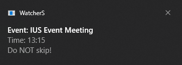
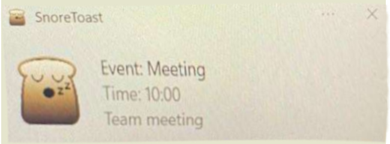
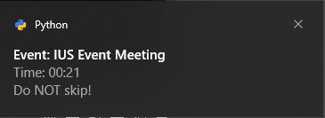
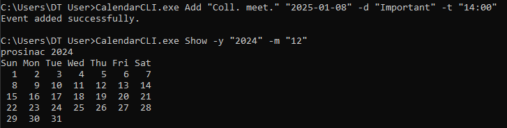
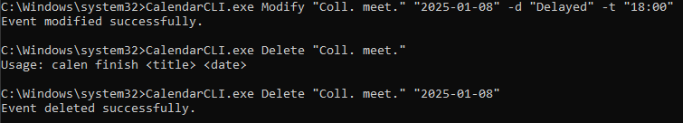
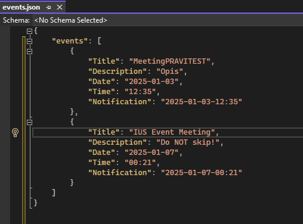

# Command-Line Calendar Project

The Command-Line Calendar is a cross-language CLI application for event and task management, implemented in Python, C#, and JavaScript. Users can add, modify, delete, and list tasks or events, while also leveraging notifications and calendar views. Each version utilizes the unique strengths of its programming language to deliver a robust and efficient user experience.

---

## Project Goals

The project aims to provide a lightweight, intuitive, and cross-platform way to manage events directly from the command line, complete with notifications and calendar display features.

---

## Features

- **Calendar Display**: View current or specified month/year.
- **Event Management**:
  - Add, modify, delete, and list events.
  - Mark events as finished.
  - Notifications for scheduled events (Python and C# versions).
- **Data Storage**: JSON files store ongoing and completed events for persistence.
- **Multi-language Support**: Implementations in Python, C#, and JavaScript.

---

## Repository Structure

```
cli-calendar/
├── C#/
│   ├── WatcherService/
│   │   ├── WatcherS.exe
│   │   ├── Program.cs
│   │   ├── WatcherS.csproj
│   ├── CalendarProgram/
│       ├── CalendarCLI.exe
│       ├── Program.cs
│       ├── CalendarCLI.csproj
├── PY/
│   ├── cli_calendar.py
│   ├── cli_utils.py
│   ├── notifications_utils.py
│   ├── watcher.py
├── JS/
│   ├── text_calendar.js
│   ├── cli_calendar.js
│   ├── cal_utils.js
├── README.md
```

---

## Installation

### Clone the Repository

```bash
git clone https://github.com/kebab0o/CalendarCLI.git
cd cli-calendar
```

### Download the C# Executables

The C# `.exe` files are hosted externally due to GitHub's file size limits. Download them from the following Mega link:

[Download C# Executables](https://mega.nz/folder/09F2mL4Z#Epk7KSjFtDMpYwTer6nz3g)

---

## Language-Specific Details

### Python Version

The Python implementation supports notifications on Windows using `win10toast`.

#### Setup

1. Ensure Python is installed.
2. Install dependencies:

   ```bash
   pip install win10toast
   ```

#### Usage Examples

- **Add Event**:

  ```bash
  python cli_calendar.py add "Event Title" "2024-11-15" -d "Description" -t "09:00" -n "2024-11-15-07:00"
  ```

- **Show Calendar**:

  ```bash
  python cli_calendar.py show -y 2024 -m 11
  ```

#### Dependencies

- `argparse`
- `json`
- `datetime`
- `time`
- `win10toast`

---

### C# Version

The C# implementation includes event notifications and a calendar display, powered by the .NET framework.

#### Setup

1. Ensure the .NET SDK is installed.
2. Install dependencies with NuGet:

   ```bash
   dotnet add package Newtonsoft.Json
   dotnet add package System.CommandLine
   dotnet add package Microsoft.Toolkit.Uwp.Notifications
   ```

3. Run the Calendar application:

   ```bash
   dotnet run
   ```
   OR:
   Paste the `CalendarCLI.exe` into your CMD's PATH folder (usually `C:\Windows\System32`).  
   Run the `WatcherS.exe` as administrator (or use the script to autorun it during Windows startup).  
   Open Command Prompt (cmd) as administrator and use the application accordingly.  

#### Usage Examples

- **Add Event**:

  ```bash
  dotnet run Add "Event Title" "2024-11-15" -d "Description"
  ```

- **Show Calendar**:

  ```bash
  dotnet run calendar -y "2024" -m "11"
  ```

#### Dependencies

- `Newtonsoft.Json`
- `System.CommandLine`
- `Microsoft.Toolkit.Uwp.Notifications`

---

### JavaScript Version

The JavaScript version focuses on task management and calendar views with a lightweight Node.js implementation.

#### Setup

1. Ensure Node.js is installed.
2. Install dependencies:

   ```bash
   npm install commander node-notifier
   ```

3. Run the application:

   ```bash
   node cli_calendar.js <command>
   ```

#### Usage Examples

- **Show Current Month**:

  ```bash
  node cli_calendar.js show
  ```

- **Add Event**:

  ```bash
  node cli_calendar.js add 2024 11 15 "My Task"
  ```

#### Dependencies

- `commander`
- `node-notifier`

---

## Showcasing

Below are examples of how the applications appear in action:

### Notifications





### Command Prompt Demo





---

## License

This project is licensed under the MIT License.

---

We wish you a smooth and joyful experience using our CMD Calendar!
